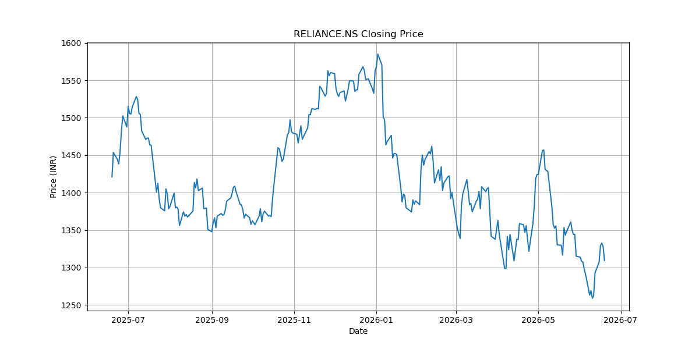

# AI Trading Analytics Platform

## Overview

AI Trading Analytics Platform is a Python-based stock market analytics application that downloads live market data from Yahoo Finance, calculates technical indicators, performs risk analysis, generates trading insights, and visualizes results through professional charts.

This project demonstrates practical applications of financial analytics, quantitative trading concepts, data analysis, and software engineering best practices using a modular Python architecture.

---

## Features

### Market Data

* Download live stock market data from Yahoo Finance
* Support for NSE, BSE, and global stock symbols
* Automatic CSV export for historical analysis

### Technical Indicators

* Simple Moving Average (SMA)
* Exponential Moving Average (EMA)
* Relative Strength Index (RSI)
* MACD (Moving Average Convergence Divergence)
* Bollinger Bands

### Risk Analytics

* Daily Returns Calculation
* Annualized Volatility
* Sharpe Ratio
* Maximum Drawdown

### Trading Insights

* Trend Detection Engine
* Buy / Hold / Sell Recommendations
* Momentum Analysis

### Visualization

* Stock Price Charts
* SMA & EMA Analysis
* RSI Indicator Chart
* MACD Indicator Chart
* Bollinger Bands Visualization

---

## Project Structure

```text
ai-trading-analytics-platform/
│
├── data/
│   ├── raw/
│   └── processed/
│
├── reports/
│
├── screenshots/
│
├── notebooks/
│
├── src/
│   ├── analytics/
│   │   ├── risk_analysis.py
│   │   └── trend_analysis.py
│   │
│   ├── data/
│   │   └── data_loader.py
│   │
│   ├── indicators/
│   │   ├── sma.py
│   │   ├── ema.py
│   │   ├── rsi.py
│   │   ├── macd.py
│   │   └── bollinger.py
│   │
│   ├── visualization/
│   │   └── charts.py
│   │
│   └── main.py
│
├── requirements.txt
├── README.md
├── LICENSE
└── .gitignore
```

---

## Installation

### Clone the Repository

```bash
git clone https://github.com/koushiksoppa/ai-trading-analytics-platform.git
cd ai-trading-analytics-platform
```

### Create Virtual Environment

```bash
python -m venv venv
```

### Activate Virtual Environment

Windows (Git Bash)

```bash
source venv/Scripts/activate
```

Windows (CMD)

```bash
venv\Scripts\activate
```

### Install Dependencies

```bash
pip install -r requirements.txt
```

---

## Running the Application

```bash
python src/main.py
```

Example:

```text
Enter Stock Symbol: RELIANCE.NS
```

Supported examples:

```text
RELIANCE.NS
TCS.NS
INFY.NS
HDFCBANK.NS
SBIN.NS
```

---

## Sample Output

```text
============================================================
AI TRADING ANALYTICS PLATFORM
============================================================

Stock: RELIANCE.NS
Current Price: 1309.50
RSI: 48.65
Trend: NEUTRAL
Recommendation: HOLD
Volatility: 20.31%
Sharpe Ratio: -0.55
Maximum Drawdown: -20.58%
============================================================
```

---

## Screenshots

### Price Analysis



### RSI Indicator


### MACD Indicator


### Bollinger Bands


---

## Technologies Used

* Python
* Pandas
* NumPy
* Matplotlib
* Yahoo Finance API (yfinance)

---

## Financial Concepts Covered

### Technical Analysis

* Trend Following
* Momentum Analysis
* Volatility Analysis

### Quantitative Finance

* Risk Measurement
* Sharpe Ratio
* Drawdown Analysis

### Trading Indicators

* SMA
* EMA
* RSI
* MACD
* Bollinger Bands

---

## Future Enhancements (Version 1.1)

* Portfolio Analytics Dashboard
* Multi-Stock Comparison
* PDF Report Generation
* Candlestick Chart Analysis
* Risk-Adjusted Portfolio Allocation

### Future AI/ML Roadmap

* Machine Learning Price Forecasting
* LSTM-based Prediction Models
* XGBoost Trading Signals
* Sentiment Analysis from Financial News
* Reinforcement Learning Trading Agent

---

## Author

**Koushik Soppa**

Aspiring Quantitative Analyst | Data Analyst | AI & Trading Enthusiast

GitHub: https://github.com/koushiksoppa

---

## License

This project is licensed under the MIT License.
